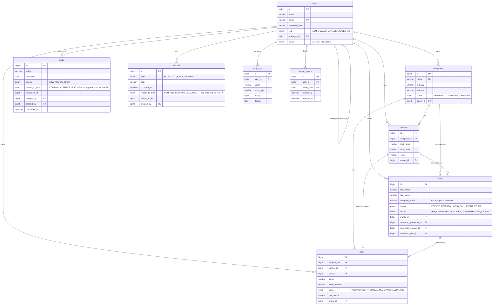

# Entity-Relationship Diagram

The 9 tables behind the CRM (§7 of the implementation plan). Renders natively
on GitHub — no external tool needed to view it.

## Notes

- **`tasks`/`activities`' polymorphic link** (`related_to_type`/`related_to_id`)
  can't be a real foreign key across four possible target tables — MySQL has
  no polymorphic FK. It's enforced in the Service layer instead: the target
  must exist and be visible to the caller before the insert (§7.4).
- **`leads` ↔ `deals` is circular** (a lead converts into a deal; a deal can
  point back to the lead it came from) — handled with two migrations: create
  `leads` without the `converted_deal_id` FK, create `deals`, then add the FK
  back onto `leads` once `deals` exists.
- **Companies and Customers are one table.** A "customer" is just a company
  whose `status` has advanced to `CUSTOMER` — see the plan's §7.3 decision.
- **Notes and Activities are one table.** A "note" is an Activity with
  `type = NOTE`; the Notes tab is just the Activity timeline filtered to it.
